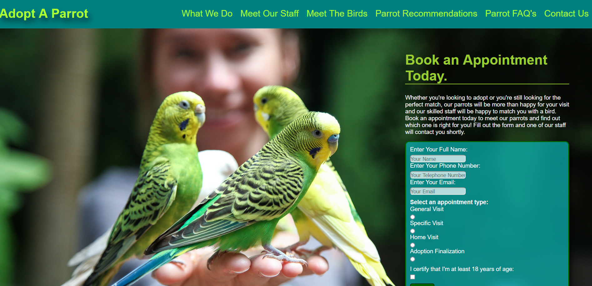

# Adopt-A-Parrot

## Description
The goal of this project was to design a website for a fictional company that houses and adopts out parrots.  This project enabled me to practice with HTML, and CSS.  It also allowed me to practice user interface design, ensuring that code meets accessibility requirements, and making a website responsive.

## Built With
* HTML
* CSS

## Website

Deployed Page: https://mirandal27.github.io/Adopt-A-Parrot/

## Credits
Miranda Lane

All photos are from Pexels.com.  Credit is appreciated but not required as per the license for use
which can be found here: https://www.pexels.com/license/